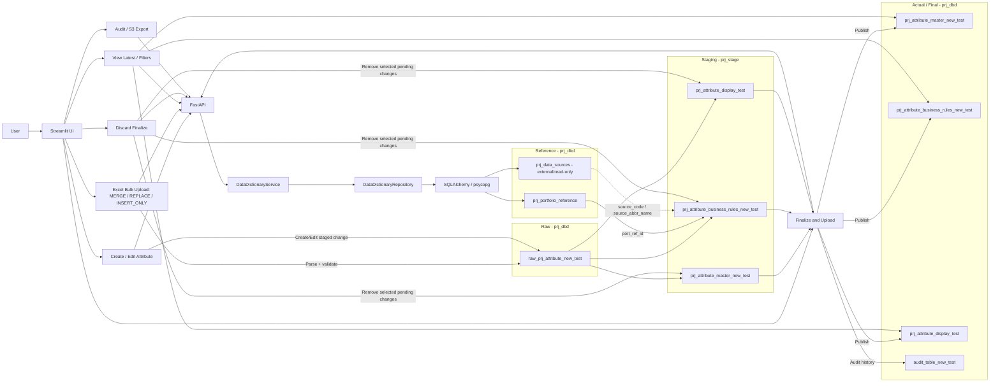

# Data Dictionary Administration Platform — Application Flow & PostgreSQL ERD

> **Current PostgreSQL physical schemas**
> - Main / Actual: `prj_dbd` (or configured `PG_SCHEMA`)
> - Staging: `prj_stage`
> - The diagrams show the default table basenames. The application can route to alternate staging/final basenames configured in the **Target Tables** sidebar.

## 1. Application Flow — Confluence Mermaid

Paste the following into a Confluence Mermaid macro/plugin.



### Flow interpretation

1. **Create/Edit** and **Excel Upload** create a raw/staged change set; they do not immediately overwrite the final dictionary.
2. Excel supports `MERGE`, `REPLACE`, and `INSERT_ONLY`. Blank physical attribute names are generated programmatically after uniqueness checks.
3. Scope/business fields are persisted in Business Rules; display/scope-presentation fields are persisted in Display.
4. **Validate & Compare / Finalize** compares staging with the selected Actual/Final targets.
5. **Finalize and Upload** publishes the staged Master, Business Rules and Display rows and writes Audit history.
6. **Discard Finalize** removes selected pending staging changes; final data remains unchanged.
7. `prj_portfolio_reference` supplies `port_ref_id`; `prj_data_sources` supplies Source values and is an external/read-only dependency.

## 2. PostgreSQL ER Diagram — Confluence Mermaid

```mermaid
erDiagram
    PRJ_PORTFOLIO_REFERENCE ||--o{ STG_BUSINESS_RULES : port_ref_id
    PRJ_PORTFOLIO_REFERENCE ||--o{ FINAL_BUSINESS_RULES : port_ref_id

    STG_MASTER ||--o{ STG_BUSINESS_RULES : prj_id
    STG_MASTER ||--o{ STG_DISPLAY : prj_id
    STG_BUSINESS_RULES ||--|| STG_DISPLAY : scope_id

    FINAL_MASTER ||--o{ FINAL_BUSINESS_RULES : prj_id
    FINAL_MASTER ||--o{ FINAL_DISPLAY : prj_id
    FINAL_BUSINESS_RULES ||--|| FINAL_DISPLAY : scope_id

    PRJ_DATA_SOURCES ||..o{ STG_BUSINESS_RULES : source_abbr_name
    PRJ_DATA_SOURCES ||..o{ FINAL_BUSINESS_RULES : source_abbr_name

    PRJ_PORTFOLIO_REFERENCE {
      int port_ref_id PK
      varchar portfolio_name
      varchar sector_name
      varchar sub_sector
      varchar remarks
      boolean is_active
    }

    PRJ_DATA_SOURCES {
      varchar source_code PK
      varchar source_name
    }

    STG_MASTER {
      varchar prj_id PK
      varchar prj_attribute_name
      text prj_attribute_definition
      varchar prj_physical_attribute_name UK
      varchar segment
      boolean is_active
    }

    STG_BUSINESS_RULES {
      bigint scope_id PK
      varchar prj_id FK
      int port_ref_id FK
      varchar source_abbr_name
      text prompt_description
      text examples_for_llm
      char editable
      varchar data_type
      varchar attribute_type
      text business_logic
      text calculation_logic
    }

    STG_DISPLAY {
      bigint display_id PK
      bigint scope_id FK_UK
      int display_order
      varchar prj_id FK
      varchar display_name
      varchar section "default N/A"
      varchar subsection "default N/A"
      text prj_attribute_definition
      text prj_attribute_description
      varchar segment
      varchar report_type
    }

    FINAL_MASTER {
      varchar prj_id PK
      varchar prj_attribute_name
      text prj_attribute_definition
      varchar prj_physical_attribute_name UK
      varchar segment
      boolean is_active
    }

    FINAL_BUSINESS_RULES {
      bigint scope_id PK
      varchar prj_id FK
      int port_ref_id FK
      varchar source_abbr_name
      text prompt_description
      text examples_for_llm
      char editable
      varchar data_type
      varchar attribute_type
      text business_logic
      text calculation_logic
    }

    FINAL_DISPLAY {
      bigint display_id PK
      bigint scope_id FK_UK
      int display_order
      varchar prj_id FK
      varchar display_name
      varchar section "default N/A"
      varchar subsection "default N/A"
      text prj_attribute_definition
      text prj_attribute_description
      varchar segment
      varchar report_type
    }
```

### Additional PostgreSQL tables

- `prj_dbd.raw_prj_attribute_new_test`: raw ingestion/audit-friendly representation before staging.
- `prj_dbd.audit_table_new_test`: before/after history of finalized and other tracked changes.
- `prj_dbd.prj_data_sources`: external/read-only source lookup. `source_abbr_name` is a logical reference to `source_code`; the current DDL does not enforce it as a foreign key.

### Physical FK relationships

- `prj_stage.prj_attribute_business_rules_new_test.prj_id` → `prj_stage.prj_attribute_master_new_test.prj_id`
- `prj_stage.prj_attribute_business_rules_new_test.port_ref_id` → `prj_dbd.prj_portfolio_reference.port_ref_id`
- `prj_stage.prj_attribute_display_test.scope_id` → `prj_stage.prj_attribute_business_rules_new_test.scope_id`
- `prj_stage.prj_attribute_display_test.prj_id` → `prj_stage.prj_attribute_master_new_test.prj_id`
- `prj_dbd.prj_attribute_business_rules_new_test.prj_id` → `prj_dbd.prj_attribute_master_new_test.prj_id`
- `prj_dbd.prj_attribute_business_rules_new_test.port_ref_id` → `prj_dbd.prj_portfolio_reference.port_ref_id`
- `prj_dbd.prj_attribute_display_test.scope_id` → `prj_dbd.prj_attribute_business_rules_new_test.scope_id`
- `prj_dbd.prj_attribute_display_test.prj_id` → `prj_dbd.prj_attribute_master_new_test.prj_id`

